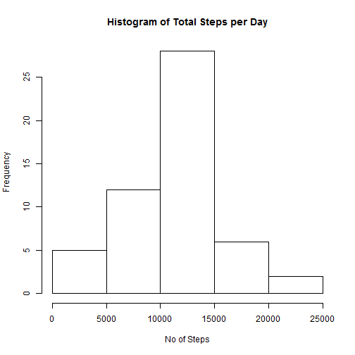
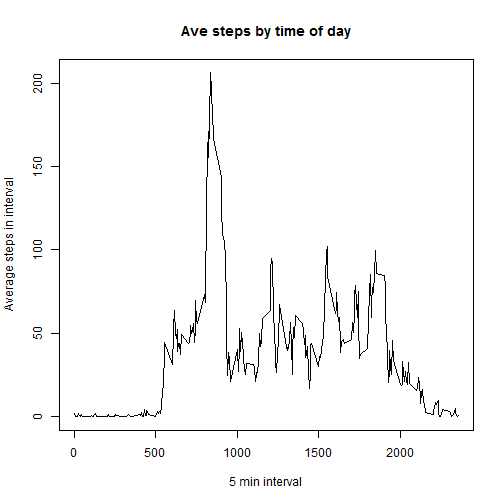
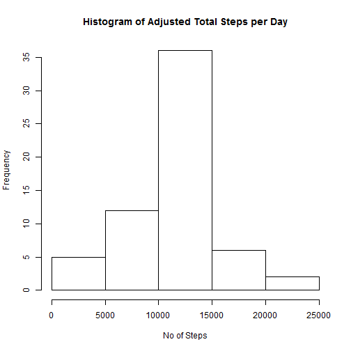
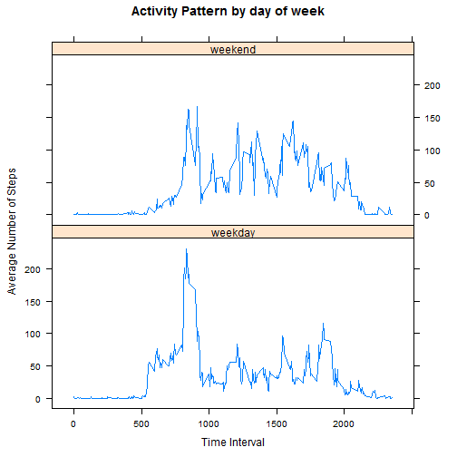

## Loading and preprocessing the data

```r
# read in the activity data and create a version with missing values removed
fullDat <- read.csv("activity.csv",stringsAsFactors = FALSE)
tidyDat <- fullDat[!is.na(fullDat$steps),]
```


## What is mean total number of steps taken per day?

```r
library(dplyr)
# group and summarise the number of steps by date
grpSteps <- group_by(tidyDat,date)
totals <- summarise(grpSteps,perDay=sum(steps))

# plot a histogram of the total steps per day
hist(totals$perDay,xlab = "No of Steps", main = "Histogram of Total Steps per Day")
```

 

```r
# calculate and display mean and median
print(paste0("Mean of the total number of steps taken per day: ",round(mean(totals$perDay),2)))
```

```
## [1] "Mean of the total number of steps taken per day: 10766.19"
```

```r
print(paste0("Median of the total number of steps taken per day: ",round(median(totals$perDay),2)))
```

```
## [1] "Median of the total number of steps taken per day: 10765"
```


## What is the average daily activity pattern?

```r
# group and summarise by the time interval in the day
int <- group_by(tidyDat,interval)
intervls <- summarise(int,aveSteps=mean(steps))

# make a line plot of the average steps in each interval
plot(intervls$interval,intervls$aveSteps,
     type = "l",xlab = "5 min interval", ylab = "Average steps in interval",
     main = "Ave steps by time of day")
```

 

```r
# calculate and display the interval with the maximum number of steps
highest <- intervls[intervls$aveSteps==max(intervls$aveSteps),]
print(paste0("The interval with the maximum number of steps is ",highest$interval))
```

```
## [1] "The interval with the maximum number of steps is 835"
```

## Imputing missing values

```r
# find the number of missing values
print(paste0("The number of rows with missing values is ", NROW(fullDat[is.na(fullDat$steps),])))
```

```
## [1] "The number of rows with missing values is 2304"
```

```r
# use the mean number of steps for each interval over all days to cover missing values
# meansteps function takes an interval and returns the average steps in that interval
meanSteps <- function(x){intervls$aveSteps[intervls$interval==x]}

# replace the missing values with the average from the meansteps function 
newDat <- mutate(fullDat,adjSteps = 150000)
for(i in 1:NROW(newDat)){
    if(is.na(newDat$steps[i])){
        newDat$adjSteps[i] <- meanSteps(newDat$interval[i])
    }
    else{
        newDat$adjSteps[i] <- newDat$steps[i]
    }
}

# plot the adjusted data and compute the mean and median
adjGrpSteps <- group_by(newDat,date)
dayTotals <- summarise(adjGrpSteps,daily=sum(adjSteps))
hist(dayTotals$daily,xlab = "No of Steps", main = "Histogram of Adjusted Total Steps per Day")
```

 

```r
print(paste0("Mean of the adjusted total number of steps taken per day: ",round(mean(dayTotals$daily),2)))
```

```
## [1] "Mean of the adjusted total number of steps taken per day: 10766.19"
```

```r
print(paste0("Median of the adjusted total number of steps taken per day: ",       round(median(dayTotals$daily),2)))
```

```
## [1] "Median of the adjusted total number of steps taken per day: 10766.19"
```

As can be seen from comparison of the two plots, the central part of the histogram is hardly changed but the bars at the lower and upper end of the range move up, i.e. they have higher frequency counts. This suggests that most of the missing data was in periods of low or high activity. The mean of the adjusted distribution is the same as the previous mean. This can be understood if the missing values were roughly evenly distributed over periods of high and low activity. Also, the number of missing values 2304 is small compared to the total number of observations 17,568.

## Are there differences in activity patterns between weekdays and weekends?

```r
library(lattice)

# create factors for weekend and weekday
newDat2 <- mutate(newDat,dayType =
                  ifelse(weekdays(as.Date(newDat$date)) %in% c("Saturday","Sunday"),
                  "weekend","weekday"))

# group and summarise by type of day and time interval
newDat2 <- group_by(newDat2, dayType, interval)
newDat2 <- summarise(newDat2, avSteps = mean(adjSteps))

# make a lattice plot of average steps per time interval by type of day
xyplot(avSteps~interval | dayType, data = newDat2, type = "l", layout = c(1,2),
       xlab = "Time Interval", ylab = "Average Number of Steps",
       main = "Activity Pattern by day of week")
```

 

As can be seen from the plot, the activity pattern is different at weekends. The overall level of activity is lower and more uniform, without the early morning peak of the weekday.


